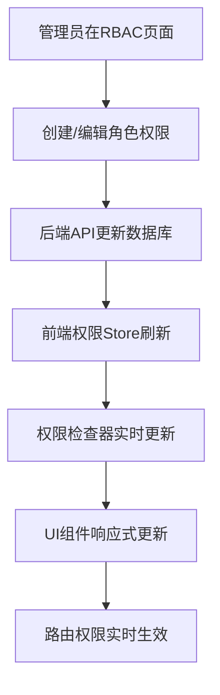

# 动态RBAC系统使用指南

## 📋 概述

本项目实现了完全动态的RBAC（基于角色的访问控制）系统，支持：
- ✅ **动态角色管理**：可通过管理界面创建、编辑、删除角色
- ✅ **动态权限管理**：可通过管理界面创建、编辑、删除权限
- ✅ **系统级保护**：核心系统角色和权限受到保护，不可误删
- ✅ **实时生效**：无需重启应用，权限变更即时生效
- ✅ **完全无代码**：新增角色和权限无需修改代码重新发布

## 🏗️ 系统架构

### 核心组件

```
├── 后端 (FastAPI)
│   ├── 权限管理API     # /api/v1/rbac/permissions
│   ├── 角色管理API     # /api/v1/rbac/roles  
│   ├── 用户权限API     # /api/v1/rbac/me/permissions
│   └── 数据库模型      # Role, Permission, RolePermission
│
├── 前端 (Nuxt 4)
│   ├── 权限管理页面    # /rbac/permissions
│   ├── 角色管理页面    # /rbac/roles
│   ├── 权限检查器      # usePermissions()
│   └── 动态权限Store   # usePermissionsStore()
│
└── 共享配置
    ├── 系统权限定义    # config/permissions.ts
    └── 路由权限配置    # config/routes.ts
```

### 数据流



## 🔧 系统权限vs业务权限

### 系统权限（受保护，不可删除）

```typescript
// 用户管理权限
user:read      // 查看用户
user:write     // 编辑用户  
user:delete    // 删除用户

// 角色管理权限
role:read      // 查看角色
role:write     // 编辑角色
role:delete    // 删除角色

// 权限管理权限
permission:read    // 查看权限
permission:write   // 编辑权限
permission:delete  // 删除权限

// 系统页面权限
page:users         // 访问用户管理页面
page:roles         // 访问角色管理页面
page:permissions   // 访问权限管理页面
```

### 业务权限（可自由管理）

```typescript
// 业务页面权限
page:dashboard     // 访问工作台（示例）

// 业务功能权限（可扩展）
report:read        // 查看报表
report:export      // 导出报表
order:manage       // 订单管理
product:manage     // 产品管理
```

### 系统角色（受保护，不可删除）

```typescript
super_admin    // 超级管理员：拥有所有权限
admin          // 管理员：拥有大部分管理权限
user           // 普通用户：拥有基础权限
```

## 📝 管理流程

### 1. 添加新权限

#### 步骤1：通过管理界面添加

1. 访问 `/rbac/permissions`
2. 点击"新增权限"按钮
3. 填写权限信息：
   ```
   权限标识: order:manage
   显示名称: 订单管理
   描述: 允许用户管理订单信息
   ```
4. 点击"保存"

#### 步骤2：权限自动生效

✅ **无需重启应用**
✅ **无需修改代码**
✅ **权限立即可用**

#### 步骤3：在代码中使用

```vue
<template>
  <!-- 权限检查 -->
  <UButton v-if="permissions.hasPermission('order:manage')">
    管理订单
  </UButton>
  
  <!-- 权限守卫组件 -->
  <PermissionGuard :permissions="['order:manage']">
    <OrderManagementPanel />
  </PermissionGuard>
</template>

<script setup>
const permissions = usePermissions()
</script>
```

### 2. 添加新角色

#### 步骤1：通过管理界面添加

1. 访问 `/rbac/roles`
2. 点击"新增角色"按钮
3. 填写角色信息：
   ```
   角色标识: manager
   显示名称: 部门经理
   描述: 部门管理人员，拥有部门相关权限
   ```
4. 选择角色权限：
   - ✅ `user:read` (查看用户)
   - ✅ `order:manage` (订单管理)
   - ✅ `report:read` (查看报表)
5. 点击"保存"

#### 步骤2：角色自动生效

✅ **无需重启应用**
✅ **无需修改代码**
✅ **角色立即可分配给用户**

#### 步骤3：动态角色显示

系统会自动适配新角色的显示：

```typescript
// 用户管理页面会自动显示新角色
const getRoleLabel = (role: string): string => {
  const permissionsStore = usePermissionsStore()
  
  // 动态获取角色显示名称
  if (permissionsStore.initialized) {
    const displayName = permissionsStore.getRoleDisplayName(role)
    if (displayName) return displayName
  }
  
  // 降级处理
  return role
}
```

### 3. 添加新页面权限

#### 步骤1：添加页面权限

1. 在权限管理页面添加新权限：
   ```
   权限标识: page:analytics
   显示名称: 数据分析页面
   描述: 访问数据分析页面的权限
   ```

#### 步骤2：配置路由权限

```typescript
// config/routes.ts
export const routePermissions: RoutePermissionConfig[] = [
  {
    path: '/analytics',
    permissions: ['page:analytics'],  // 新增的权限
    description: '数据分析页面'
  }
]
```

#### 步骤3：页面权限检查

```vue
<!-- pages/analytics.vue -->
<template>
  <div>数据分析内容</div>
</template>

<script setup>
// 页面级权限检查
definePageMeta({
  middleware: 'auth',
  // 权限检查会自动根据路由配置进行
})
</script>
```

## 🎯 权限检查方式

### 1. 基础权限检查

```typescript
const permissions = usePermissions()

// 单个权限检查
if (permissions.hasPermission('order:manage')) {
  // 有权限的逻辑
}

// 多个权限检查（需要全部满足）
if (permissions.hasAllPermissions(['user:read', 'user:write'])) {
  // 有所有权限的逻辑
}

// 多个权限检查（满足任意一个）
if (permissions.hasAnyPermission(['order:read', 'order:write'])) {
  // 有任意权限的逻辑
}
```

### 2. 组件级权限检查

```vue
<template>
  <!-- 权限守卫组件 -->
  <PermissionGuard :permissions="['order:manage']">
    <OrderForm />
  </PermissionGuard>
  
  <!-- 带fallback的权限检查 -->
  <PermissionGuard 
    :permissions="['report:export']"
    show-fallback
    fallback-message="需要报表导出权限"
  >
    <UButton>导出报表</UButton>
  </PermissionGuard>
  
  <!-- 自定义权限检查 -->
  <PermissionGuard 
    :custom-check="(perms) => perms.hasAdminPermissions"
    show-fallback
    fallback-message="需要管理员权限"
  >
    <AdminPanel />
  </PermissionGuard>
</template>
```

### 3. 路由级权限检查

权限检查会自动根据路由配置进行：

```typescript
// config/routes.ts
export const routePermissions: RoutePermissionConfig[] = [
  {
    path: '/orders',
    permissions: ['order:manage'],
    description: '订单管理页面'
  },
  {
    path: '/admin',
    customCheck: (user, permissions) => {
      return permissions.hasAdminPermissions
    },
    description: '管理员页面'
  }
]
```

## 🔄 权限同步机制

### 1. 权限Store初始化

```typescript
// stores/permissions.ts
export const usePermissionsStore = defineStore('permissions', () => {
  const initialized = ref(false)
  
  // 应用启动时自动初始化
  const init = async () => {
    await fetchPermissionsConfig()
    await fetchRolesConfig()
    initialized.value = true
  }
  
  // 动态获取权限配置
  const fetchPermissionsConfig = async () => {
    const { data } = await $fetch('/api/v1/rbac/permissions')
    permissionsConfig.value = data
  }
})
```

### 2. 实时权限更新

```typescript
// 权限变更时自动刷新
const updatePermission = async (permissionData) => {
  await rbacApi.updatePermission(permissionData)
  
  // 立即刷新权限配置
  await permissionsStore.fetchPermissionsConfig()
  
  // 权限检查器自动响应更新
}
```

### 3. 响应式权限检查

```typescript
// composables/usePermissions.ts
export const usePermissions = () => {
  const permissionsStore = usePermissionsStore()
  
  // 响应式权限检查
  const hasPermission = (permission: string): boolean => {
    if (!permissionsStore.initialized) {
      return false
    }
    return permissionsStore.hasRolePermission(currentUserRole.value, permission)
  }
  
  // 计算属性自动更新
  const canManageOrders = computed(() => hasPermission('order:manage'))
  
  return {
    hasPermission,
    canManageOrders
  }
}
```

## 🎨 UI适配

### 1. 动态角色显示

```vue
<template>
  <UBadge :color="getRoleColor(user.role)">
    {{ getRoleLabel(user.role) }}
  </UBadge>
</template>

<script setup>
// 动态角色显示
const getRoleColor = (role: string): UIColor => {
  const permissionsStore = usePermissionsStore()
  
  // 系统角色使用预定义颜色
  if (role === 'super_admin') return 'error'
  if (role === 'admin') return 'warning'
  if (role === 'user') return 'success'
  
  // 自定义角色根据系统级别决定颜色
  if (permissionsStore.isSystemRole(role)) {
    return 'warning'
  }
  
  return 'primary'  // 业务角色用主色
}
</script>
```

### 2. 权限状态标识

```vue
<template>
  <div class="permission-item">
    <span>{{ permission.display_name }}</span>
    
    <!-- 系统级权限标识 -->
    <UBadge v-if="permission.is_system" color="error" size="sm">
      系统级
    </UBadge>
    
    <!-- 业务级权限标识 -->
    <UBadge v-else color="primary" size="sm">
      业务级
    </UBadge>
    
    <!-- 操作按钮（系统级权限保护） -->
    <div class="actions">
      <UButton 
        v-if="canEditPermission(permission.name)"
        size="sm"
      >
        编辑
      </UButton>
      
      <UButton 
        v-if="canDeletePermission(permission.name)"
        color="error"
        size="sm"
      >
        删除
      </UButton>
    </div>
  </div>
</template>
```

## 🚀 最佳实践

### 1. 权限命名规范

```typescript
// 推荐命名格式
resource:action

// 示例
user:read          // 查看用户
user:write         // 编辑用户
user:delete        // 删除用户
order:manage       // 订单管理
report:export      // 导出报表
page:dashboard     // 访问工作台页面
```

### 2. 角色设计原则

```typescript
// 角色层次设计
super_admin    // 系统超级管理员
admin          // 系统管理员
manager        // 业务经理
operator       // 业务操作员
user           // 普通用户
```

### 3. 权限粒度控制

```typescript
// 细粒度权限控制
const permissions = usePermissions()

// 用户操作权限
const canEditUser = (targetUser) => {
  // 管理员可以编辑所有用户
  if (permissions.hasPermission('user:write')) {
    return true
  }
  
  // 用户只能编辑自己
  return targetUser.id === permissions.currentUserId
}

// 角色操作权限
const canDeleteRole = (roleName) => {
  // 需要删除权限
  if (!permissions.hasPermission('role:delete')) {
    return false
  }
  
  // 系统角色不能删除
  return !permissionsStore.isSystemRole(roleName)
}
```

### 4. 错误处理

```typescript
// 权限检查失败处理
const handlePermissionError = (requiredPermission: string) => {
  const toast = useToast()
  
  toast.add({
    title: '权限不足',
    description: `需要 ${requiredPermission} 权限`,
    color: 'error'
  })
  
  // 可选：跳转到权限申请页面
  // navigateTo('/request-permission')
}
```

## 🔍 调试和监控

### 1. 权限调试页面

访问 `/example-permissions` 查看：
- 当前用户权限状态
- 所有权限的检查结果
- 权限类型（系统级/业务级）
- 权限保护状态

### 2. 控制台调试

```typescript
// 在浏览器控制台中调试
const permissions = usePermissions()
const permissionsStore = usePermissionsStore()

// 检查当前用户权限
console.log('当前角色:', permissions.currentUserRole)
console.log('是否管理员:', permissions.hasAdminPermissions)
console.log('权限配置:', permissionsStore.permissionsConfig)

// 测试权限检查
console.log('是否有订单管理权限:', permissions.hasPermission('order:manage'))
```

### 3. 权限日志

系统会自动记录权限检查日志：

```typescript
// 权限检查日志
[INFO] Permission check: user:123 -> order:manage -> GRANTED
[WARN] Permission check: user:456 -> admin:panel -> DENIED
[ERROR] Permission check: invalid permission format -> invalid:permission
```

## 🎉 总结

本动态RBAC系统实现了：

✅ **完全动态化**：角色和权限可通过界面管理，无需代码变更
✅ **实时生效**：权限变更立即生效，无需重启应用
✅ **系统保护**：核心系统组件受到保护，防止误操作
✅ **类型安全**：TypeScript全程支持，确保类型安全
✅ **响应式设计**：权限状态变化UI自动响应
✅ **易于扩展**：新增权限和角色流程简单直观

通过这套系统，开发者可以：
- 🎯 **专注业务逻辑**：无需关心权限管理的技术细节
- 🚀 **快速迭代**：新功能权限可快速配置上线
- 🔒 **安全可靠**：多层权限检查确保系统安全
- 📊 **便于管理**：直观的管理界面降低运维成本

---

*更多技术细节请参考项目内的具体实现代码和API文档。* 